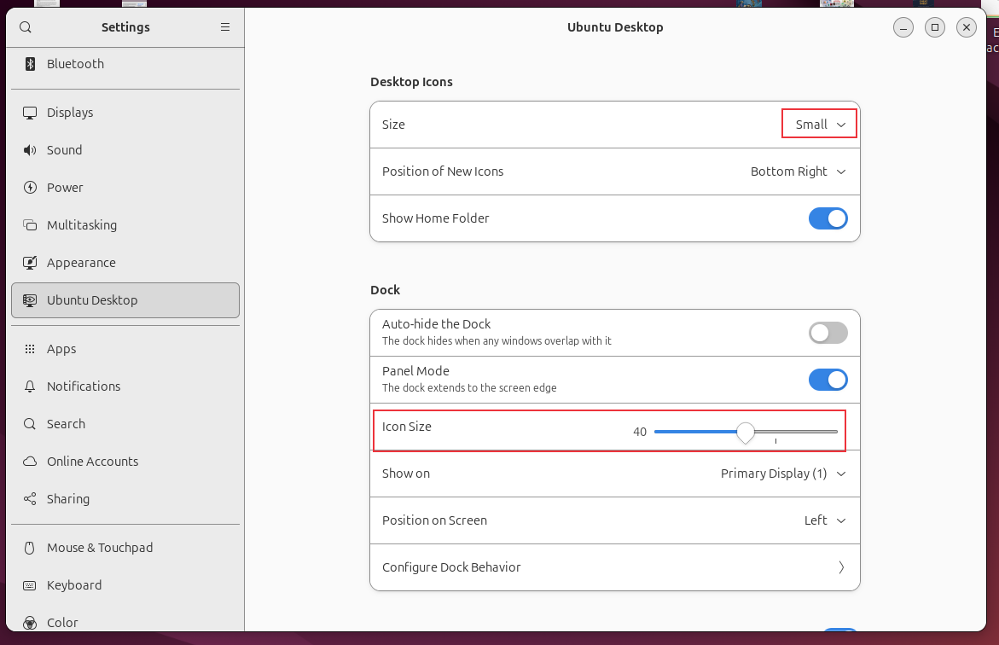
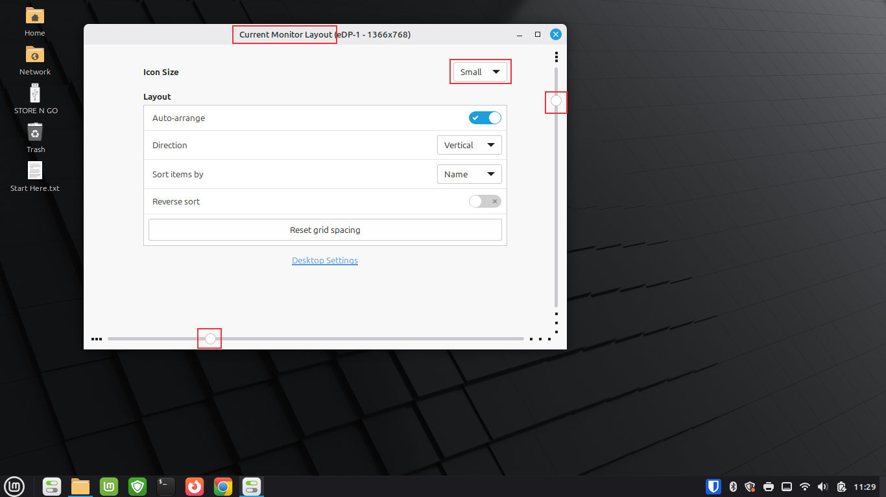

**Linux Desktop Optimization**

Linux workstation optimization and configuration documentation with screenshots and verification steps.

I built this project to document how I optimize Linux workstations for productivity and usability.

In many business environments, end users request changes that make their computers easier to use, such as adjusting desktop layouts, organizing icons, or customizing navigation. Supporting those requests requires more than knowing where the settings are located; it requires understanding how to configure the workstation in a way that improves the user experience while maintaining a consistent desktop environment.

This project documents that process through repeatable work instructions and verification screenshots.

Although the screenshots were captured on Ubuntu and Linux Mint, the administrative concepts demonstrated throughout this repository apply across many desktop environments.

Desktop customization, workstation preparation, verification, and documentation are responsibilities commonly performed by desktop support technicians and systems administrators when preparing computers for end users.

Objective
- Configure desktop icon settings
- Optimize dock behavior
- Organize desktop layout
- Improve workstation usability
- Configure desktop workflow preferences
- Verify desktop configuration changes
- Document workstation optimization steps
- Create repeatable Linux workstation work instructions

Desktop Icon Configuration (Ubuntu)

I configured the desktop icon settings to create a cleaner and more organized workspace. Choosing smaller desktop icons allows more items to remain visible without cluttering the desktop while maintaining easy access to commonly used folders.

- Small sets the desktop icon size.
- The desktop continues displaying the Home folder for quick access.
- These settings improve workspace organization while keeping the desktop simple.

Desktop Layout Configuration (Linux Mint)

I reviewed the Linux Mint desktop layout settings to organize desktop icons and improve usability. These settings control how icons are arranged and displayed across the desktop.

- Current Monitor Layout shows the display currently being configured.
- Small sets the desktop icon size.
- Auto-arrange keeps desktop icons aligned automatically.
- Direction determines how icons are organized.
- Sort Items By organizes icons alphabetically.
- Reset Grid Spacing restores the default desktop layout if needed.

Skills
- Linux Desktop Administration
- Linux Workstation Configuration
- Desktop Environment Management
- Workstation Optimization
- User Experience Configuration
- Linux System Settings
- Technical Documentation
- Technical Writing

I built this project to demonstrate how workstation optimization supports end-user productivity.

I documented configuration changes that improve desktop organization, workflow, and usability.

While the tools shown in this repository are specific to Linux, the administrative concepts - workstation preparation, user experience optimization, verification, and documentation - are job responsibilities commonly shared across Linux and Windows desktop administration.

Navigation

[`Back to GitHub Profile`](https://www.github.com/cbueker-it)
